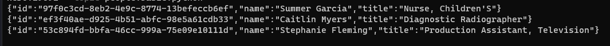

# Kafka Producer API Python

Antes de executar __producer.py__, certifique-se de que tenha criado o ambriente docker.
Ao fazer a primeira requisição, o tópico será criado, caso ainda não exista.

### Exemplo:
```
Invoke-WebRequest -Method GET -Uri http://localhost:5000/
```
ou...
```
curl -Method GET -Uri http://localhost:5000/
```

Após, execute o seguinte comando para receber as mensagems no kafka:
```
docker exec -it cli-tools kafka-console-consumer --bootstrap-server broker0:29092 --topic {topic_name}
```

Agora que estamos ouvindo por mensagens, podemos enviar informações ao consumer.

### Exemplo:

```
Invoke-WebRequest -Method POST -Uri http://localhost:5000/api/people -ContentType application/json -Body (@{"count"=3}|ConvertTo-Json)
```

Se tudo ocorrer como o esperado, você tera uma resposta semelhante a:

